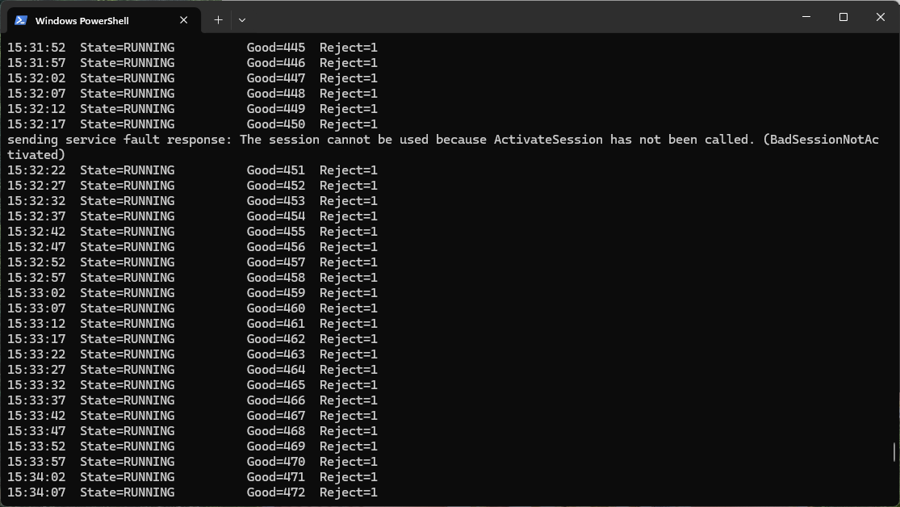
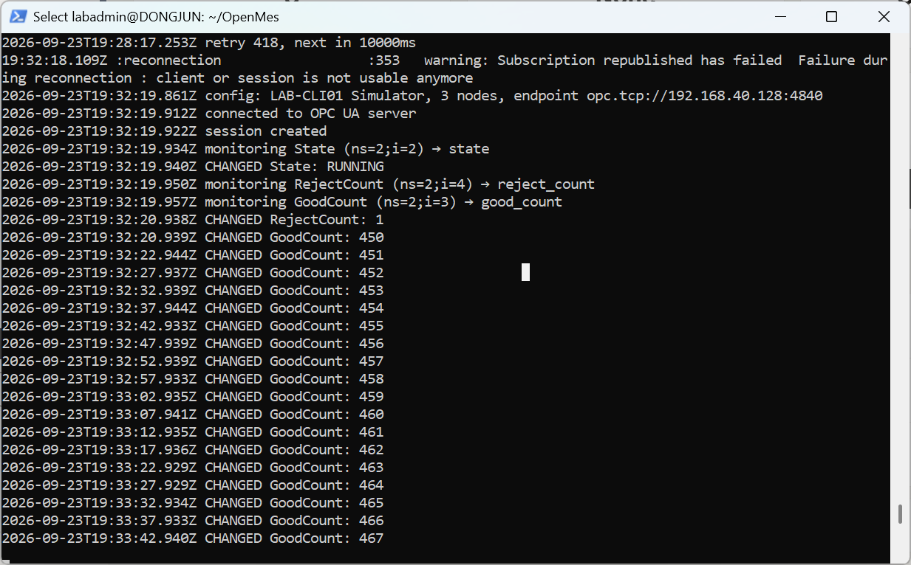
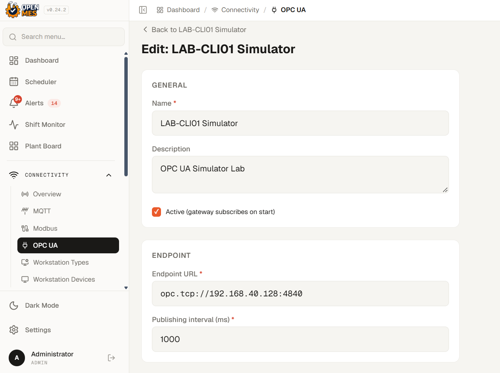

# OpenMES + OPC UA Integration Lab

Hands-on OpenMES and OPC UA integration lab for machine-data connectivity, troubleshooting, and production-count validation.

## Overview

This lab demonstrates an end-to-end machine-data integration flow using an OPC UA simulator and the open-source OpenMES platform.

The goal was to configure an OPC UA connection, monitor simulated machine signals, trace the data through the OPC UA gateway, troubleshoot counter-value handling, and validate the machine count against an OpenMES work order.

## Lab Environment

- Windows 11 Pro host
- Docker Desktop
- WSL2 Ubuntu for the OpenMES source workspace and Docker CLI
- VMware Workstation
- Windows 11 VM running the OPC UA simulator/server
- OpenMES services running in Docker containers
- Node.js OPC UA gateway

## Architecture

```text
Windows 11 VM
OPC UA Simulator / Server
(State, GoodCount, RejectCount)
          |
          | OPC UA
          v
OpenMES OPC UA Gateway
(Node.js / Docker)
          |
          | HTTP API
          v
OpenMES
Machine Counter
          |
          v
Work Order / Batch Step
```

## 1. OPC UA Simulator

The simulator runs on a separate Windows 11 VM and generates machine-state and production-counter values.



The simulated signals include:

- `State`
- `GoodCount`
- `RejectCount`

## 2. Gateway Subscription and Data Flow

The OpenMES OPC UA gateway connects to the simulator as an OPC UA client, creates a session, monitors the configured nodes, and receives value changes.



The gateway then forwards the readings to the OpenMES backend through its machine-signal API.

## 3. OpenMES OPC UA Connection

The simulator was configured as an OPC UA connection in OpenMES.



The OPC UA endpoint used in the lab was configured for the simulator running on the separate VM.

## 4. OPC UA Tags and Signals

Three OPC UA nodes were mapped to OpenMES signals:

- `State` → machine state
- `RejectCount` → reject count
- `GoodCount` → good production count


This confirmed that the gateway was connected, receiving the configured tags, and maintaining its heartbeat with OpenMES.
