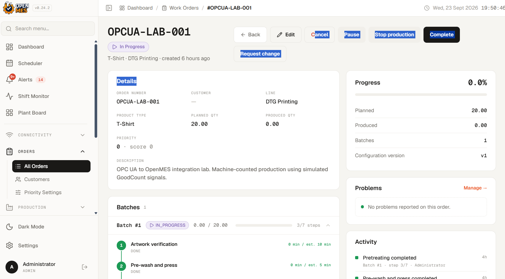
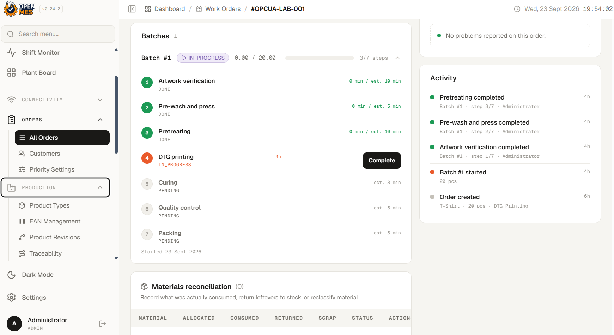

# OpenMES + OPC UA Integration Lab

Hands-on lab using OpenMES and OPC UA to connect machine data to an MES.

## Overview

In this lab, I connected an OPC UA simulator to the open-source OpenMES
platform.

I wanted to learn how machine data moves from an OPC UA server to an
MES.

I tested three machine signals, checked the data in the OPC UA gateway,
fixed a counter-value problem, and used the machine count in an OpenMES
work order.

## Lab Environment

-   Windows 11 Pro host
-   Docker Desktop
-   WSL2 Ubuntu for the OpenMES source files and Docker commands
-   VMware Workstation
-   Windows 11 VM running the OPC UA simulator/server
-   OpenMES services running in Docker containers
-   Node.js OPC UA gateway

## Architecture

``` text
Windows 11 VM
OPC UA Simulator / Server
(State, GoodCount, RejectCount)
          |
          | OPC UA
          v
OpenMES OPC UA Gateway
(Node.js / Docker)
          |
          | HTTP API
          v
OpenMES
Machine Counter
          |
          v
Work Order / Batch Step
```

## 1. OPC UA Simulator

The OPC UA simulator runs on a separate Windows 11 VM.

It creates test machine data.


The test signals are:

-   `State`
-   `GoodCount`
-   `RejectCount`

## 2. Gateway Subscription and Data Flow

The OpenMES OPC UA gateway connects to the simulator as an OPC UA
client.

It creates a session, watches the OPC UA nodes, and receives new values.


The gateway sends the values to the OpenMES backend through an API.

## 3. OpenMES OPC UA Connection

I added the OPC UA simulator as a connection in OpenMES.


The endpoint points to the OPC UA simulator running on the Windows 11
VM.

## 4. OPC UA Tags and Signals

I connected three OPC UA nodes to OpenMES signals:

-   `State` → machine state
-   `RejectCount` → reject count
-   `GoodCount` → good production count


The gateway was running and receiving data from the three OPC UA nodes.

## 5. Live Shift Monitoring

I used the OpenMES shift monitor to check the workstation during the
test.


This let me see the workstation in OpenMES while the OPC UA gateway was
receiving machine data.

## 6. Work Order Setup

I created a test work order called `OPCUA-LAB-001`.

The planned quantity was 20 units.



I used this work order to test how machine counts are used in OpenMES.

## 7. Batch Step Assignment

The work order had a DTG printing step.

I started this step for the OPC UA counting test.



I assigned the `GoodCount` machine counter to this step.

This allowed the machine count to be used for the active batch step.

## 8. Machine Counter Integration

I set `GoodCount` as a cumulative machine counter.

It was assigned to the DTG printing batch step.


During the test, OpenMES recorded 20 good units.

The simulator's raw counter continued to increase.

This showed that the machine count traveled from the OPC UA simulator,
through the gateway, and into OpenMES.

## Troubleshooting

During an earlier test, the counter value did not look correct.

I checked the existing Node.js OPC UA gateway code and traced how the
OPC UA value was handled.

A 64-bit OPC UA counter could appear as a two-part value. I added a
small change to convert this value into a normal number.

I also kept the OPC UA timestamp when the gateway sent the reading to
OpenMES.

After the change, I restarted the gateway and checked the counter values
again.

AI tools were used as a learning and troubleshooting aid while I
reviewed and modified the gateway code.

## What I Learned

-   How an OPC UA client connects to an OPC UA server
-   How a session and subscription are used to monitor OPC UA nodes
-   How machine signals move through a gateway into an MES
-   How a machine counter can be connected to a work-order step
-   How to trace a data problem from the OPC UA value to the gateway
    code
-   How Docker, WSL2, and a Windows VM can be used together in one lab

## Scope and Attribution

This lab uses the open-source OpenMES project.

I did not develop the OpenMES platform or the original OPC UA gateway.

My work focused on installing and configuring the lab, connecting the
OPC UA simulator, testing the data flow, troubleshooting the counter
value, making a small gateway change, and checking the result in
OpenMES.
